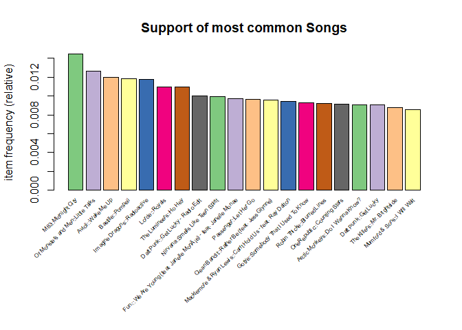
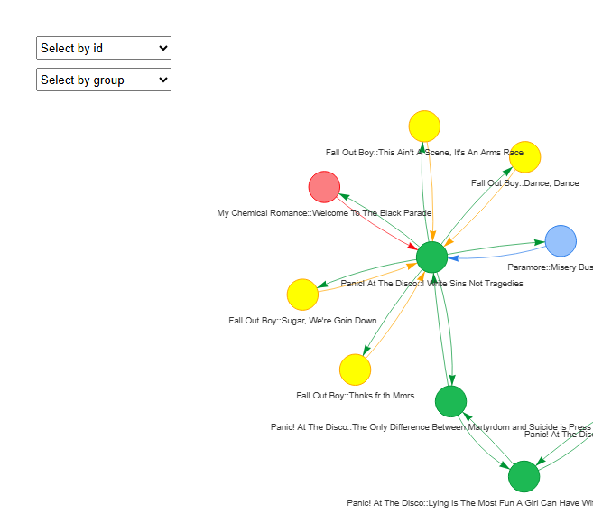

Spotify Recommender System
================

# Introduction

Recommendation Systems are found in many aspects of our daily lives,
using the Apriori Algorithm and Market Basket Analysis, we create a
Spotify Song Recommender Dashboard. This project aims to discover
clusters of songs that often appear together as well as generating
Association rules for future preferences.

The data can be found here
<https://www.kaggle.com/datasets/andrewmvd/spotify-playlists/code>.

``` r
data = read_excel("spotify_dataset2.xlsx") %>% select(user_id,`"artistname"`,`"trackname"`,`"playlistname"`) %>%
  setNames(c("id","artistname","trackname","playlistname"))

head(data)
```

    ## # A tibble: 6 × 4
    ##   id                               artistname             trackname playlistname
    ##   <chr>                            <chr>                  <chr>     <chr>       
    ## 1 9cc0cfd4d7d7885102480dd99e7a90d6 Elvis Costello         (The Ang… HARD ROCK 2…
    ## 2 9cc0cfd4d7d7885102480dd99e7a90d6 Elvis Costello & The … (What's … HARD ROCK 2…
    ## 3 9cc0cfd4d7d7885102480dd99e7a90d6 Tiffany Page           7 Years … HARD ROCK 2…
    ## 4 9cc0cfd4d7d7885102480dd99e7a90d6 Elvis Costello & The … Accident… HARD ROCK 2…
    ## 5 9cc0cfd4d7d7885102480dd99e7a90d6 Elvis Costello         Alison    HARD ROCK 2…
    ## 6 9cc0cfd4d7d7885102480dd99e7a90d6 Lissie                 All Be O… HARD ROCK 2…

# Data Preperation

To prepare the data for the Apriori Algorithm, we need to prepare the
data into a One-Hot Encoded Dataframe where each row is a unique
“playlist” identifier and each column is a unique “song” identifier.

Here are the playlists in descending frequency from the dataset.

``` r
data %>% group_by(playlistname) %>% summarise(count = n()) %>%  arrange(desc(count))
```

    ## # A tibble: 18,262 × 2
    ##    playlistname          count
    ##    <chr>                 <int>
    ##  1 Starred               94581
    ##  2 Liked from Radio      16904
    ##  3 CHILL                  8477
    ##  4 Everything at once     7892
    ##  5 Spotify Library        7645
    ##  6 Strane                 6825
    ##  7 Rock                   6665
    ##  8 OSTs                   5010
    ##  9 Favoritas de la radio  4692
    ## 10 Rich's iPhone          4603
    ## # ℹ 18,252 more rows

Here are the song names in descending frequency from the dataset.

``` r
data %>% group_by(trackname) %>% summarise(count = n()) %>%  arrange(desc(count))
```

    ## # A tibble: 386,270 × 2
    ##    trackname     count
    ##    <chr>         <int>
    ##  1 Intro           557
    ##  2 Home            468
    ##  3 Closer          324
    ##  4 Hold On         309
    ##  5 Radioactive     305
    ##  6 Runaway         291
    ##  7 Wake Me Up      289
    ##  8 Alive           267
    ##  9 Stay            267
    ## 10 Midnight City   263
    ## # ℹ 386,260 more rows

We notice that some playlists and songs share the same names. In this
case the trackname “Intro”

``` r
data %>% filter(trackname == "Intro") %>% head()
```

    ## # A tibble: 6 × 4
    ##   id                               artistname trackname playlistname      
    ##   <chr>                            <chr>      <chr>     <chr>             
    ## 1 07f0fc3be95dcd878966b1f9572ff670 The xx     Intro     Work playlist     
    ## 2 c50566d83fba17b20697039d5824db78 Disclosure Intro     Everything at once
    ## 3 7511e45f2cc6f6e609ae46c15506538c The xx     Intro     Liked from Radio  
    ## 4 50346e4190d1707ebc6b39a95f86927a Gagle      Intro     Japon             
    ## 5 50346e4190d1707ebc6b39a95f86927a Nemir      Intro     Nemir – Ailleurs
    ## 6 1ed9910b0db7fcb779ec65b2ded4892f JAY Z      Intro     Starred

Likewise with playlist, lets create a new column for both “User +
Playlist” and “Artist + Trackname” as identifiers. We also drop NaN
Values preemptively. Additionally, “Starred” and “Liked From Radio”
Playlist names will be removed for Apriori association analysis.

``` r
apri_data = data %>% drop_na() %>% filter(playlistname != "Liked from Radio", playlistname != "Starred") %>%
  mutate("basket" = paste(id,playlistname, sep = "_"),
         "item" = paste(artistname,trackname,sep = "::"))
head(apri_data)
```

    ## # A tibble: 6 × 6
    ##   id                              artistname trackname playlistname basket item 
    ##   <chr>                           <chr>      <chr>     <chr>        <chr>  <chr>
    ## 1 9cc0cfd4d7d7885102480dd99e7a90… Elvis Cos… (The Ang… HARD ROCK 2… 9cc0c… Elvi…
    ## 2 9cc0cfd4d7d7885102480dd99e7a90… Elvis Cos… (What's … HARD ROCK 2… 9cc0c… Elvi…
    ## 3 9cc0cfd4d7d7885102480dd99e7a90… Tiffany P… 7 Years … HARD ROCK 2… 9cc0c… Tiff…
    ## 4 9cc0cfd4d7d7885102480dd99e7a90… Elvis Cos… Accident… HARD ROCK 2… 9cc0c… Elvi…
    ## 5 9cc0cfd4d7d7885102480dd99e7a90… Elvis Cos… Alison    HARD ROCK 2… 9cc0c… Elvi…
    ## 6 9cc0cfd4d7d7885102480dd99e7a90… Lissie     All Be O… HARD ROCK 2… 9cc0c… Liss…

We will also remove data of songs that appear less than 5 times in the
whole dataset

``` r
apri_data = apri_data %>% group_by(item) %>% filter(n() >= 5) %>% ungroup()
```

Here is the final One-Hot Encoded Dataframe where each row is a unique
“playlist” identifier and each column is a unique “song” identifier.

``` r
input_data = apri_data %>% select(basket,item) %>% distinct()
apri_matrix = split(input_data$item, input_data$basket) %>% as("transactions") %>%
  as("binaryRatingMatrix")
```

To get a sensing of the data, here are the top 20 most frequent songs in
this dataset

``` r
itemFrequencyPlot(apri_matrix@data, topN = 20, type="relative",
                  col = brewer.pal(8, 'Accent'),
                  cex.names = 0.5,
                  main = "Support of most common Songs")
```

<!-- -->
Looking at the songs listed, we can very much tell that this dataset was
collected before 2020 :)

# Apriori Algorithm and Association Rules

Below run the data through the Apriori Algorithm to get our recommender
objecet using the “recommederlab” library. From the object, we can
extract our associasion rules based on their support,lift and
confidence.

Below are the rules with the lowest support of minimum 0.0006 and a
confidence of 0.2.

``` r
apri_rec <- Recommender(apri_matrix, 
                      method = "AR", 
                      parameter = list(support = 0.0006,
                                       confidence = 0.2,
                                       maxlen = 2))
rules = getModel(apri_rec)$rule_base %>% as("data.frame") %>% clean_names() %>%
  arrange((support)) %>% mutate(rules = str_remove_all(rules, "[{}]")) %>%
  separate(col = rules,
           into = c("from","to"),
           sep = " => ") %>% mutate(lhs = from, rhs = to) %>%
  separate(col = lhs,
           into = c("from_artist","from_trackname"),
           sep = "::") %>% select(-from_trackname) %>%
  separate(col = rhs,
           into = c("to_artist","to_trackname"),
           sep = "::") %>% select(-to_trackname)
head(rules)
```

    ##                                           from
    ## 1           Pablo Alboran::Donde Está El Amor
    ## 2                          John Legend::Dreams
    ## 3 John Legend::What If I Told You? (Interlude)
    ## 4                          John Legend::Dreams
    ## 5      John Legend::Love In The Future (Intro)
    ## 6                          John Legend::Dreams
    ##                                             to      support confidence
    ## 1                        Pablo Alboran::Quién 0.0006050013          1
    ## 2 John Legend::What If I Told You? (Interlude) 0.0006050013          1
    ## 3                          John Legend::Dreams 0.0006050013          1
    ## 4      John Legend::Love In The Future (Intro) 0.0006050013          1
    ## 5                          John Legend::Dreams 0.0006050013          1
    ## 6                        John Legend::Tomorrow 0.0006050013          1
    ##       coverage     lift count   from_artist     to_artist
    ## 1 0.0006050013 1144.308     9 Pablo Alboran Pablo Alboran
    ## 2 0.0006050013 1652.889     9   John Legend   John Legend
    ## 3 0.0006050013 1652.889     9   John Legend   John Legend
    ## 4 0.0006050013 1652.889     9   John Legend   John Legend
    ## 5 0.0006050013 1652.889     9   John Legend   John Legend
    ## 6 0.0006050013 1652.889     9   John Legend   John Legend

Lets test our system by running a song that I currently enjoy.

``` r
new_playlist_items = c("Paramore::Misery Business")

new_user_data = (colnames(apri_matrix) %in% new_playlist_items) %>% matrix(nrow=1)
colnames(new_user_data) = colnames(apri_matrix)
new_user_data = as(new_user_data, "binaryRatingMatrix")

predict(apri_rec, new_user_data, n = 5) %>% as("list")
```

    ## $`0`
    ## [1] "Paramore::crushcrushcrush"                       
    ## [2] "Jimmy Eat World::The Middle"                     
    ## [3] "Nirvana::Smells Like Teen Spirit"                
    ## [4] "My Chemical Romance::Welcome To The Black Parade"
    ## [5] "Paramore::That's What You Get"

Looking at its suggestions I think it has given me rather solid choices
:)

# Graphical Illustration

We can also visualise these rules from the Apriori algorithm to
construct a graph. Lets start with the same artist, Paramore

``` r
artist = "Panic! At The Disco"
rules_filtered = rules %>% filter(from_artist == artist | to_artist == artist)
```

``` r
nodes = rules_filtered %>% select(from,to) %>% pivot_longer(cols = c(from,to)) %>%
  select(value) %>% unique() %>% rename(id = value) %>%
  mutate(id2 = id) %>%
  separate(col = id2,
           into = c("group","trackname"),
           sep = "::") %>% select(-trackname)

edges = rules_filtered %>% select(from,to)

# Create the interactive visualization
visNetwork(nodes, edges) %>%
  visGroups(groupname = artist, color = "#1DB954") %>%
  visEdges(arrows ="to") %>% 
  visOptions(selectedBy = "group",
             highlightNearest = TRUE,
             nodesIdSelection = TRUE) %>%
  visPhysics(enabled = T,stabilization = T,solver = "forceAtlas2Based") %>%
  visLayout(randomSeed = 123) %>%
  visInteraction(dragNodes = T, dragView = T, zoomView = T)
```

<!-- -->

From the graph we notice that Paramore’s songs are often in the same
playlist as other songs from the Pop Punk genre (Fall Out Boy, MCR etc.)

# Conclusion

Overall, the Apriori Algorithm is a good way to identify frequent
itemsets and association rules and in this case how music preferences
overlap in real-world listening habits. This project could also be
applied to a more pragmatic scenario like retail analytics, where
identifying ‘frequently bought together’ items is essential for
personalized product recommendations, optimizing inventory placement,
and driving cross-selling strategies.
